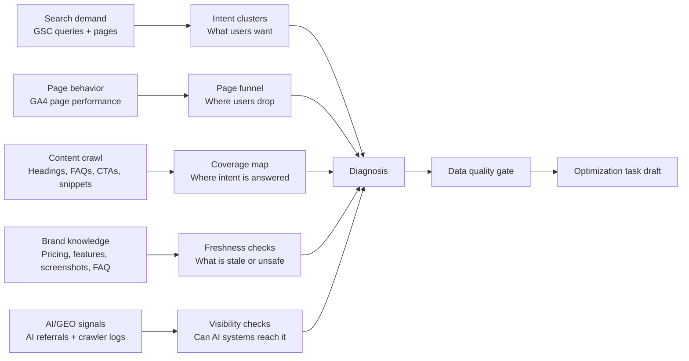
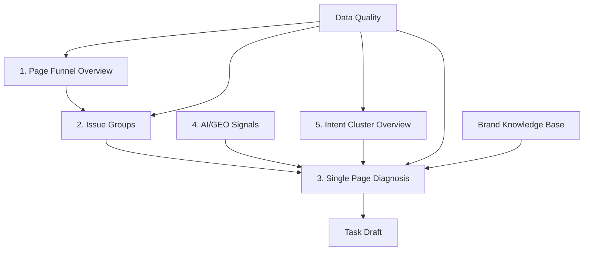
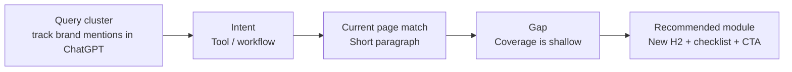
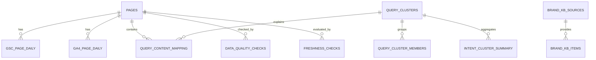

# Organic Content Intelligence

> Open-source diagnostics for organic content growth: search demand, page funnels, intent coverage, data quality, AI/GEO visibility, and optimization task drafts.

Organic Content Intelligence helps teams answer a harder question than "which page lost traffic?"

It asks:

**Is this content actually capturing the demand it attracts?**

Most SEO dashboards stop at impressions, clicks, CTR, and Position. Most analytics dashboards start after the user lands on the page. This project joins the two sides, then adds intent evidence, content coverage, freshness checks, AI/GEO signals, and data quality guardrails.

The result is a portable framework for diagnosing where organic content fails to carry users from search demand to useful action.

## Why This Exists

Content teams often have data, but not a diagnosis.

Search Console can show that a page gets impressions for new queries. GA4 can show that the page has weak engagement or few CTA clicks. A crawler can show that AI bots visited the page. A content audit can show that pricing, screenshots, or product claims are stale.

But those signals usually live in different tools.

Organic Content Intelligence turns them into one workflow:



## What It Can Diagnose

| Problem | What the system checks | Example output |
| --- | --- | --- |
| Traffic risk | GSC impressions, clicks, CTR / CTR Δ, Position movement | "This page has high exposure but worsening rank and CTR." |
| Conversion weakness | GA4 page-level sessions, engagement, CTA clicks, key events | "The page receives organic sessions but weak CTA interaction." |
| Intent gap | Query clusters vs page sections, FAQs, tables, CTAs | "New tool-intent queries have impressions, but no workflow section exists." |
| Stale content | Brand knowledge base vs article claims, screenshots, pricing, FAQ | "Pricing copy is outdated against knowledge base version 2026-06." |
| Cannibalization | Multiple pages competing for the same intent cluster | "Two articles split the same commercial intent." |
| AI/GEO visibility | AI referral sessions and crawler logs | "AI referrals exist, but ClaudeBot is blocked on this URL." |
| Data risk | Missing, incomplete, or low-confidence data | "Do not generate a task yet; manual verification required." |

## Product Surface

The demo contains five surfaces. They are deliberately generic, so teams can adapt them to their own stack.



### 1. Page Funnel Overview

The page-level command center.

It combines:

- GSC: impressions, clicks, CTR / CTR Δ, Position
- GA4-style page performance: organic sessions, engagement rate, CTA clicks, key events
- Risk scores: Traffic Risk Score, Conversion Weak Score
- Data Quality: whether the system can safely recommend action

The page list is not the final task generator. It is the entry point into diagnosis.

### 2. Issue Groups

Groups pages by problem type:

- CTR decline
- Ranking or impressions decline
- Conversion weakness
- Stale content
- New query opportunity
- Intent cannibalization
- AI/GEO visibility weakness

This helps teams work in batches instead of inspecting URLs one by one.

### 3. Single Page Diagnosis

The evidence room for one page.

It shows which query clusters the page attracts, what intent each cluster represents, how well the page covers that intent, and where the content should be improved.

Query-to-content mapping is shown as an expandable detail layer, not a permanent table. This keeps the page readable while preserving evidence.



### 4. AI / GEO Signals

Two related but separate tables:

- AI Referral Sessions from analytics
- AI Crawler Logs from server, edge, or CDN logs

The project keeps these signals separate because referral traffic and crawler accessibility answer different questions.

### 5. Intent Cluster Overview

A library-level view.

Instead of asking "which page is weak?", this view asks "which user intents are we covering well or poorly across the whole content library?"

This is useful for content strategy, pruning, consolidation, and roadmap planning.

## Data Model at a Glance



## Data Quality Gate

Every recommendation reads from the same object:

```json
{
  "quality_grade": "High",
  "reason_codes": [],
  "checked_at": "2026-06-16T00:00:00Z"
}
```

| Grade | Meaning | UI action |
| --- | --- | --- |
| High | Evidence is good enough for automation | Generate task draft |
| Medium | Useful, but needs human verification | Needs verification |
| Low | Useful for diagnosis only | Diagnostics only |
| Invalid | Do not judge | No judgment |

This guardrail matters because content optimization systems can easily look more certain than the data allows.

## Important Attribution Boundary

GA4 data is treated as **page-level performance**.

Query clusters explain search intent and content fit. They do not prove that a specific query cluster directly caused a conversion.

Use:

```text
GA4 Page Performance, not query attribution
```

Allowed attribution labels:

- `estimated`
- `directional`

## Quick Start

This seed project has no build step and no external dependencies.

```bash
git clone https://github.com/dageno-agents/organic-content-intelligence.git
cd organic-content-intelligence
npm run dev
```

Open:

```text
http://localhost:4173/public/
```

Run fixture checks:

```bash
npm run check
```

## For Humans and Agents

If you are evaluating the project:

- Start with this README.
- Read [Page Walkthrough](docs/page-walkthrough.md) to understand the five UI surfaces.
- Read [Data and API Spec](docs/data-api-spec.md) to connect GSC, GA4, crawler logs, and brand knowledge.
- Read [Architecture](docs/architecture.md) to understand the pipeline.

If you are a coding agent:

- Start with [Agent Guide](docs/agent-guide.md).
- Do not invent query-level conversion attribution.
- Keep Data Quality shared across all surfaces.
- Keep private customer data, internal prompts, and proprietary weights out of the open-source core.

## Repository Structure

```text
organic-content-intelligence/
  public/                 Static demo entry
  src/                    Mock data, UI rendering, scoring, URL normalization
  schemas/                JSON Schemas for shared contracts
  examples/               GSC and GA4 request examples
  docs/                   Architecture, data spec, page walkthrough, roadmap
  scripts/                Fixture validation
```

## Open-Core Boundary

Good open-source core:

- Dashboard shell
- Mock data and schemas
- GSC / GA4 adapter contracts
- URL normalization
- Data Quality framework
- Basic scoring examples
- Query cluster and intent overview models

Better kept in a hosted or private layer:

- Customer data
- Proprietary scoring weights
- Internal LLM prompts
- Private brand knowledge base content
- Publishing workflow and approvals
- Managed sync infrastructure

## Naming Note

The original prototype used the slug `seo-content-funnel`, but the project direction is broader than an SEO funnel. The public product name is **Organic Content Intelligence** because it covers organic search demand, content coverage, page performance, freshness, AI/GEO visibility, and task drafting.

## References

- GitHub README guidance: https://docs.github.com/en/repositories/managing-your-repositorys-settings-and-features/customizing-your-repository/about-readmes
- GitHub Mermaid diagrams: https://docs.github.com/en/get-started/writing-on-github/working-with-advanced-formatting/creating-diagrams
- Diataxis documentation framework: https://diataxis.fr/

## License

MIT
