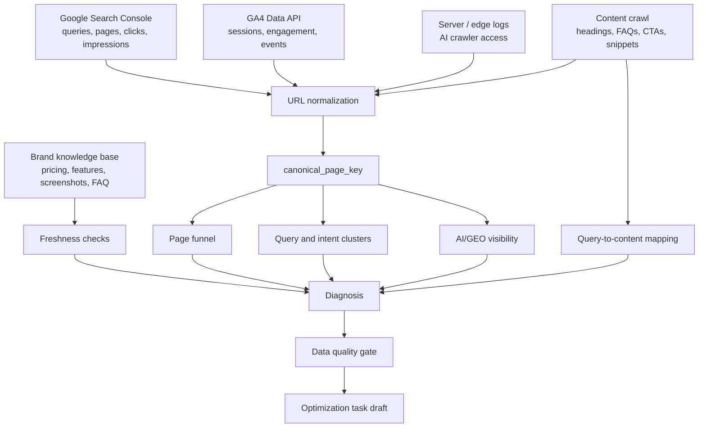
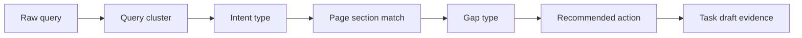
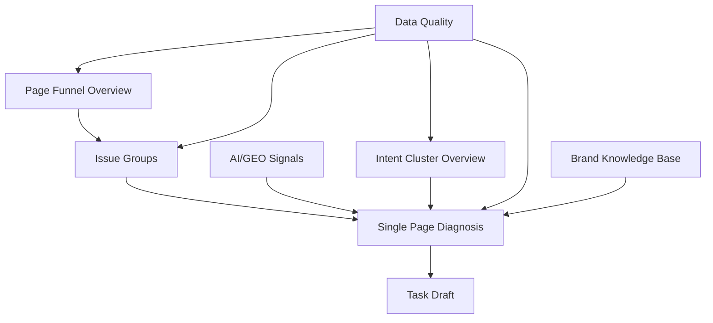

# Architecture

Organic Content Intelligence is a diagnostics system, not a single dashboard.

It connects several imperfect signals, makes uncertainty visible, and only recommends automation when the evidence is strong enough.

## System Pipeline

## Runtime Layers

### 1. Source Adapters

Adapters import data from external systems:

- Google Search Console Search Analytics API
- Google Analytics Data API
- Server, edge, CDN, or firewall logs
- Optional brand knowledge base files

Each adapter should preserve raw source fields before writing normalized aggregates.

### 2. Normalization

Every source must resolve to a shared `canonical_page_key`.

Common rules:

- Lowercase protocol and hostname.
- Remove fragments.
- Remove known tracking query parameters.
- Preserve business query parameters only when configured.
- Use canonical URL when available.
- Send unmatched URLs to Data Quality with `URL_MATCH_FAILED`.

### 3. Diagnostics Jobs

Diagnostics jobs calculate:

- Traffic Risk Score
- Conversion Weak Score
- Content Coverage Score
- Data Quality grade
- Freshness status
- Cannibalization flags
- AI/GEO visibility status

Scores should store their input components so users can understand why a page was flagged.

### 4. Evidence Model

The query cluster is the summary layer. Query-to-content mapping is the proof layer.

## API Layer

The UI should consume stable API contracts:

- `/api/pages/funnel`
- `/api/issues/groups`
- `/api/pages/{pageId}/diagnosis`
- `/api/query-clusters/{clusterId}/mapping`
- `/api/intent-clusters/overview`
- `/api/ai-geo/referrals`
- `/api/ai-geo/crawler-logs`
- `/api/task-drafts`

## UI Surfaces

The UI has five primary screens:

1. All pages funnel overview
2. Issue groups
3. Single page diagnosis
4. AI/GEO visibility and crawler logs
5. Intent cluster overview

Data Quality and Brand Knowledge Base are global modules, not primary navigation pages.

## Data Boundary

GA4 data is page-level performance data.

Query clusters explain intent and content fit.

Do not present query clusters as exact conversion attribution unless a real attribution model is added later.
