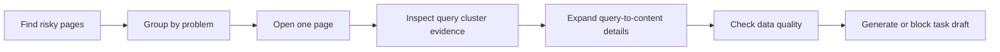
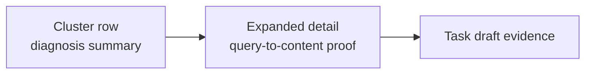
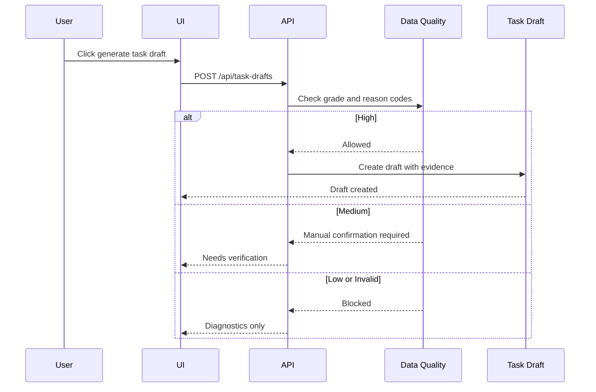

# Page Walkthrough

This guide explains the five product surfaces in Organic Content Intelligence.

It is written for product managers, engineers, content operators, and coding agents who need to understand what each page is responsible for.

## Mental Model

The system is not a reporting dashboard. It is a diagnosis workflow.



## 1. Page Funnel Overview

This is the first triage page. It helps a team decide which URLs deserve attention.

It should answer:

- Which pages have the highest organic traffic risk?
- Which pages get sessions but weak conversion behavior?
- Which pages have enough data quality to support automation?
- Which pages should only be diagnosed, not converted into tasks?

Key inputs:

| Source | Fields |
| --- | --- |
| GSC | impressions, clicks, CTR, CTR delta, Position, Position delta |
| GA4-style page data | organic sessions, engagement rate, CTA clicks, key events |
| Diagnostics | Traffic Risk Score, Conversion Weak Score |
| Data Quality | quality grade, reason codes |

The page list can start a task flow, but it should not create a final task by itself.

## 2. Issue Groups

This page groups URLs by problem type, so operators can batch similar fixes.

Example groups:

- CTR decline
- Ranking or impressions decline
- Conversion weakness
- Stale content
- New query opportunity
- Intent cannibalization
- AI/GEO visibility weakness

Every issue group table should show:

- Current issue type
- Matched page count
- Sort logic
- Exclusion rules

Example:

```text
Current filter: CTR decline
Matched pages: 18
Sort: Traffic Risk Score + Conversion Weak Score + Data Quality
Exclude: Data Quality = Invalid
```

## 3. Single Page Diagnosis

This is the real diagnosis page and the safest place to generate a task draft.

It should answer:

- Which query clusters bring demand to this page?
- What intent does each cluster represent?
- Where does the current page answer that intent?
- Which intent is missing, shallow, stale, or badly placed?
- Is the evidence strong enough to generate a task draft?

Default view: Query Cluster Evidence Table.

Recommended fields:

- query_cluster
- intent_type
- impressions
- clicks
- CTR
- Position
- content_coverage_score
- current_content_location
- recommended_action
- data_quality
- attribution_label

Query-to-Content Mapping belongs in an expanded row or drawer, not as a permanent large table.



## 4. AI / GEO Signals

This page checks whether AI systems are sending traffic to the site and whether AI crawlers can access content.

It should have one tab switcher:

- AI Referral Sessions
- AI Crawler Logs

AI Referral Sessions come from analytics data. AI Crawler Logs come from server, CDN, edge, or firewall logs.

Do not infer crawler access from GA4. Crawlers often do not execute analytics scripts.

## 5. Intent Cluster Overview

This is the strategy layer.

Instead of asking which page is weak, it asks:

- Which search intents are we winning?
- Which intents have demand but weak coverage?
- Which intents are split across too many pages?
- Which intents have AI/GEO signals?
- Which intent should become the next content or consolidation project?

Suggested fields:

| Field | Meaning |
| --- | --- |
| intent_cluster | The grouped user need |
| intent_type | informational, commercial, comparison, tool, pricing, support, navigational |
| impressions / clicks / avg CTR / avg Position | Aggregated GSC performance |
| primary_landing_page | The main page carrying this intent |
| covered_pages | Number of pages that match this intent |
| coverage_score | How completely the library covers the intent |
| traffic_risk_score | Search-side risk |
| conversion_weak_score | Page funnel weakness for the main page |
| cannibalization_flag | Whether multiple pages compete |
| ai_geo_signal | AI referral or crawler evidence |
| recommended_direction | Update, merge, split, add module, add internal links |

## Task Draft Flow



## UX Principle

The interface should make uncertainty visible.

When data is incomplete, the UI should still help users diagnose the page, but it should not pretend the system is confident enough to automate optimization.
